#OS & Network Summary
##Table of Content
[TOC]

##Chapter 1

###Parts of a Network
Component | Function | Example
:-------- | :------- | :------
**Application**, or app, user  | Uses the network | Skype, iTunes, Amazon
**Host** , or end-system, edge device, node, source, sink | Supports apps | Laptop, mobile, desktop
**Router**, or switch, node, hub, intermediate system | Relays messages between links | Access point, cable / DSL moden
**Link**, or channel | Connects nodes | Wires, wireless


###Key interfaces

* Network-application interfaces define how apps use the network (Sockets widely used)
* Network-network interfaces define how nodes work together (ex : Traceroute)

Network service API hides details (Apps don't know what is inside the network)


###Protocols and layers
To divide up network functionality

* Each instance of a protocol talks virtually to its peer using the protocol
* Each instance of a protocol uses only the services of the lower layer

Protocol stack example :

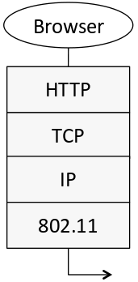

**Encapsulation : ** Lower layer wraps higher layer content and add its own information

**Advantage of layering : ** Information hiding and reusability
**Disadvantages of layering : ** Overhead and hides information


#####OSI "7 layer" Reference Model

 | Layer | Description |
-- | :-- | :---------- |
7 | Application | Provides functions needed by users|
6 | Presentation | Converts different data representations|
5| Session | Manages task dialogs
4| Transport | Provides end-to-end delivery
3| Network | Sends packets over multiple links
2| Data link | Sends frames of information
1| Physical | Sends bits as signals


#####Four layer model

Based on experience

 | Layer | Description |
-- | :-- | :---------- |
7 |Application | Programs that use network service
4 |Transport | Provides end-to-end data delivery
3 |Internet | Send packets over multiple networks
2 (/1) |Link (/Physical) | Send frames over a link (/Sends bits using signals)

#####Internet Reference Model

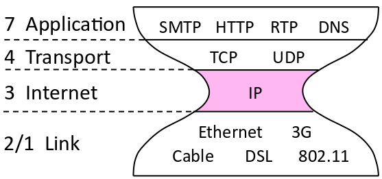

#####Layer-based names

Layer | Unit of Data
:-- | :--
Application | Message
Transport | Segment
Network | Packet
Link | Frame
physical | Bit

Devices in the network :
* Repeater (Hub) : Physical/Physical
* Switch (bridge) : Link/Link
* Router : Network+Link / Network+Link
* Proxy (middlebox, gateway) : App+Transport+Network+Link


##Chapter 2 : Physical Layer

###Socket API

Primitive | Meaning
:-- | :--
SOCKET | Create a new communication endpoint
BIND | Associate a local address with a socket
LISTEN | Announce willingness to accept connections; give queue size
ACCEPT | Passively wait for an incoming connection
CONNECT | Actively attempt to establish a connection
SEND | Send some data over the connection
RECEIVE | Receive some data from the connection
CLOSE | Release the connection

###Simple link model
Properties : Rate, Delay/Latency, wether the channel is broadcast, its error rate

##### Rate
Or bandwith, capacity, speed
in bits/second

#####Delay / latency

* Transmission delay $$$T$$$: Time to put M-bit message on the wire
$$
T = \frac{M [bits]}{Rate\left[\frac{bits}{s}\right]} = \frac{M}{R} [s]
$$

* Propagation delay $$$D$$$ : time for bits to propagate across the wire
$$
D = \frac{Length}{Speed of signals} = \frac{L}{\frac{2}{3}C}
$$

* Latency $$$L$$$ : delay to send a message over a link
$$
L = T + D = \frac{M}{R} + \frac{L}{\frac{2}{3}C}
$$

#####<a name="bd" href="#bd2">Bandwidth-delay product</a>

The amount of data "in flight"
$$BD = R\cdot D$$

###Types of Media
**Media** propagate signals that carry bits information.
Common types :
* Wires
* Fiber
* Wireless

#####Wireless
* Travel at speed of light
* Spread out and attenuate faster than $$$\frac{1}{d^2}$$$
* Interference between signals on the same frequency (=> spatial reuse of same freq)
* Multipath : signal interferes with itself after reflexion

### Modulation
How the signals represent bits


* <a name="nrz_acronym2" href="#nrz_acronym1">NRZ</a> : A high voltage +V represents a 1 and a low voltage -V represents a 0

#####Clock recovery
Receiver needs frequent signal transitions to decode bits (synchronisation)
######4b/5b
* Map every data bits into 5 code bits without long runs of zeros

4b | 5b
-- | --
0000|11110
0001|01001
1110|11100
...|...
1111|11101

* Invert signal level on every 1 (NRZI)

**Example :**
message : 1111 0000 0001

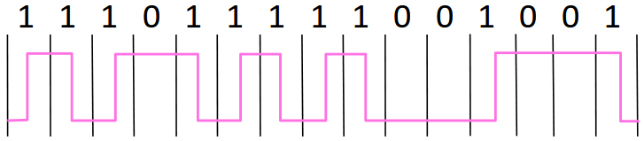

#####Baseband vs Passband modulation
**Baseband** : Signal is sent directly on a wire (wires)
**Passband** : Modulation carries a signal by modulating a carrier (fiber / wireless)
######Passband
Carrier is a signal oscillating at desired frequency. We modulate it by changing amplitude, frequency or phase

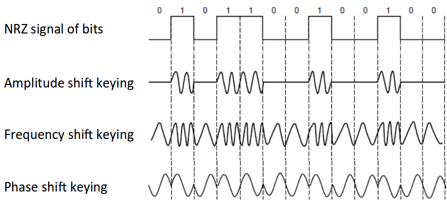

####Fundamental limits
#####Key channel properties
* Bandwidth B
* Signal strength S
* Noise strength N

#####Nyquist limit/frequency
If we have a channel with a bandwidth $$$B$$$, the maximum symbol rate is $$$2B$$$.
If we have V signal levels ($$$log_2V$$$ different bits), the maximum bit rate is
$$R=2B\cdot log_2V \left[\frac{bits}{s}\right]$$

#####Shannon capacity
The number of levels we can distinguish on a channel depends on the <a name="snr_acronym1" href="snr_acronym2">SNR</a> (~ S/N)

The Shannon capacity C is the maximum information carrying rate of the channel
$$C = B\cdot log_2\left(1+\frac{S}{N}\right) \left[\frac{bits}{s}\right]$$

**Wires / Fiber :**
Engineer SNR for data rate

**Wireless :**
Adapt data rate to SNR (can't design for worst case)


##Chapter 3 : Link Layer
Concerns how to transfer messages (frames, of limited size) over one or more connected links

###Framing
Transform stream of bits from physical layer to sequence of frames
#####Byte count
* Start each frame with a length field
* Difficult tu resynchronize after framing error

#####Byte stuffing
* Use a flag byte value for start/end of frame
* Escape the flag (and the escape code) inside the message replacing (stuffing) it with an escape code

#####Bit stuffing
* Flag with six consecutive 1
* In the message, insert a 0 after five 1 when sending and remove every 0 after five 1 when receiving
* Slightly less overhead than byte stuffing but more complicated -> byte stuffing used in practice

###Error coding

####Using error codes
Codeword consists of data bits D plus check bits R

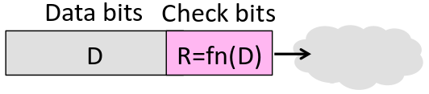

#####Hamming distance
* The distance is the number of bit flips needed to change $$$D+R_1$$$ to $$$D+R_2$$$
* The Hamming distance of a code is the minimum distance between a pair of codewords
* For a code of Hamming distance d+1, up to d errors will always be detected
* For a code of Hamming distance 2d + 1, up to d errors can always be corrected by mapping to the closest codeword

####Error Detection
* Parity bit : The parity bit is the sum of the bits of D (distance : 2 -> detect 1 error); Little used
* Checksum : Sum up data in N-bit word (Stronger than parity)
* Internet Checksum
* <a href="#acronym_crc1">CRC</a>

**In practice :**
* CRCs used on links (Ethernet, 802.11, ADSL, Cable)
* Checksum used in Internet (IP, TCP, UDP)

#####Internet Checksum
Sending :
1. Arrange data in 16-bit words
2. Add
3. Add any carryover back to get 16 bits
4. Negate (complement) to get the checksum

Receiving :
1. Arrange data in 16-bit words (including checksum)
2. Add
3. Add any carryover back to get 16 bits
4. Negate the result and check if 0

Example :
```
1.	  0001
   	 f203
   	 f4f5
2.	+ f6f7
	  ------
	   2ddf0
```
```
  	  ddf0
3.	+    2
	  ------
        ddf2

4. -> 220d
```
Transmit to physical layer : 0001 f203 f4f5 f6f7 220d


```
1.	  0001
   	 f203
   	 f4f5
	    f6f7
2.	+ 220d
	  ------
	   2rffd
```
```
  	  fff0
3.	+    2
	  ------
        ffff

4. -> 0000
```

* Distance of the code : 2
* Will always detect up to 1 error
* Will detect all burst errors up to 16
* For random errors, probability of miss is $$$\frac{1}{2^{16}}$$$ ($$$2^{16}$$$ different checksums)

#####<a name="acronym_crc1" href="#acronym_crc2">Cyclic redundancy check</a>

For data D of length n, generate check bits R of length k such that the n+k bits are evenly divisible by a generator C.

* Protection depend on generator (standard has 32bits C)
* Humming distance of 4
* Detects odd numbers of errors
* Detects bursts of up to k bits in error
* Not vulnerable to systematic errors

**Example :**
D = 302, C = 3, k (length of R) = 1
=> R = 1 because $$$\frac{3021}{3} = 0$$$

**Send procedure :**
1. Extend D with k zeros
2. Divide by the generator C
3. Ignore quotient
4. Set check bits R as the remainder

**Receive procedure :**
1. Divide by C and check for zero remainder

**Example :**
D = 10111
C = 100
k = length(C) - 1 = 2

```
101 | 1011100
      101
      ---
       001
       000
       ---
        011
        000
        ---
         110
         101
         ---
           10 = R
```
Transmitted frame : 1011110

####Error correction
It is difficult because errors can be in the check bits

#####Hamming code
Gives a method for constructing a code with a distance of 3.

**To encode :**
* With k check bits, we can check data of length $$$n = 2^k - k - 1$$$; ex: $$$k=3$$$, $$$n=4$$$
* The check bits are in positions $$$p_i$$$ that are powers of 2, starting with position 1 (1, 2, 4, 8...)
* Fill the free positions with the data bits (positions 3, 5, 6, 7...)
* Check bit in position $$$p_i$$$ is the parity of the bits at positions $$$p_j$$$ for which the $$$i^{th}$$$ bit in $$$j$$$ is 1 (ex: $$$p_2$$$ is the sum of all the bits at positions $$$p_j$$$ where the second bit in $$$j$$$ is 1 => 10 (2), 11 (3), 110 (6), 111 (7), 1010 (10), ...)

**To decode :**
* Recompute check bits $$$p_i$$$ (with parity sum including the check bit)
* Arrange as a binary number ($$$\dots p_8p_4p_2p_1$$$)
* If the value (syndrome) is zero, it means there is no error
* Otherwise the syndrome is the position of the error, flip the bit at this position

#####Detection vs Correction
**Correction**
* When error are expected and in small number
* When no time for retransmission
* Used in physical layer (<a name="acronym_ldpc1" href="#acronym_ldpc2">LDPC</a>)
* Sometimes used in the application layer

**Detection**
* When errors are not expected
* When errors are generally large
* Used in the link layer and above

###Retransmissions (<a name="acronym_arq1" href="#acronym_arq2">ARQ</a>)
* Receiver automatically acknowledges correct frames with an ACK
* Sender automatically resends after a timeout if no ACK is received
* Frames and ACKs must carry sequence numbers to avoid duplicates

#####Stop and wait
Use one bit to distinguish the current frame from the next one. Send one frame at a time

#####Sliding Window
Generalization of stop-and-wait
Allows W frames to be outstanding

###Multiplexing
Network word for the sharing of a resource
* <a name="acronym_tdm1" href="#acronym_tdm2">Time Division Multiplexing</a> : Users take turns on a fixed schedule (ex : Round-Robin)
* <a name="acronym_fdm1" href="#acronym_fdm2">Frequency Division Multiplexing</a> : Put different users on different frequency bands


####Multiple Access Control or Medium Access Control (<a name="acronym_mac1" href="#acronym_mac2">MAC</a>)

####Random Multiple Access
Basis for classic Ethernet

#####ALOHA protocol
* Node sends when it has traffic
* If there was a collision (no ACK received), wait a random amount of time and resend
* Works well only under low load

#####Carrier Sense Multiple Access(<a name="acronym_csma1" href="#acronym_csma2">CSMA</a>)
* Improve ALOHA by listening for activity before sending
* Collision can still occur because of delays

#####Carrier Sense Multiple Access with Collision Detection(<a name="acronym_csmacd1" href="#acronym_csmacd2">CSMA/CD</a>)
* Reduce the cost of collision by detecting them and aborting (jam) the rest of the frame

For a wire of max length (time) D, we impose a minimum frame size that lasts for 2D seconds. This way everyone who collides knows that it happened. A node can't finish before a collision

#####CSMA persistence
To avoid collision between nodes who queued up waiting for the current sender to finish
For N queued senders, each one sends with next with probability $$$\frac{1}{N}$$$

#####Binary Exponential Backoff (<a name="acronym_beb1" href="#acronym_beb1">BEB</a>)
Estimates the probability for CSMA persistence

* Double interval for each successive collision
* Quickly gets large enough to work and very efficient in practice

1st collision : wait 0-1 time frames
2nd collision : wait 0-3 time frames
3rd collision : wait 0-7 time frames
...

#####Ethernet
* Multiple access with 1-persistent CSMA/CD with BEB (Modern ethernet based on switches)
* Has two addresses for destination and source, CRC-32 for error detection (no ARQ)
* Physical layer preamble to identify start of frame

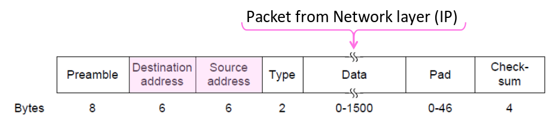

####WIreless Multiple Access
* Nodes share a single link
* Nodes can't carrier sense (different areas of coverage)
* Nodes can't hear while sending (can't collision detect)

=> WiFi can't use CSMA/CD

**Different Coverage Areas**
Signal is bradcast and received nearby where SNR is sufficient

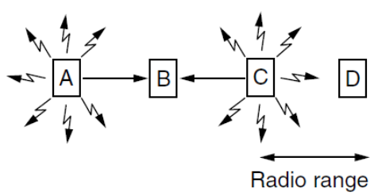

**Hidden terminals**
A and C are hidden terminals : Can't hear each other but can collide at B

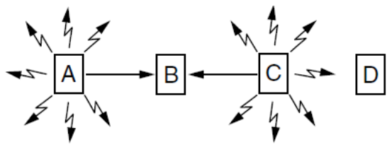

**Exposed terminals**
B and C can hear each other but don't collide at A and D

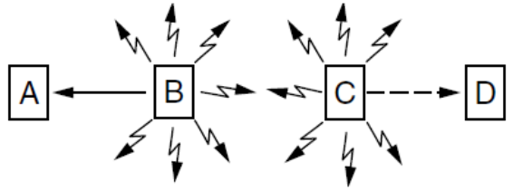

#####Multiple Access with Collision Avoidance (<a name="acronym_maca1" href="#acronym_maca2">MACA</a>)

Use short handshake instead of CSMA :
1. Senter node transmits a <a name="acronym_rts1" href="#acronym_rts2">RTS</a> with frame length
2. Receiver node replies with a <a name="acronym_cts1" href="#acronym_cts2">CTS</a> with frame length
3. Sender transmits the frame while other nodes hearing the CTS remain silent

Collision are possible but less likely

#####802.11
* Clients get connectivity from an Access Point (AP)
* O<a href="#acronym_fdm2">FDM</a> modulation
* Different amplitudes/phases for varying SNRs
* Multiple access uses CSMA/CA; RTS/CTS optional
* ARQ
* Three addresses (due to AP)
* Errors detected with a CRC-32
* Many other features (encryption, power save)


**802.11 CSMA/CA :**
Sender avoids collision by inserting a small random gap (backoff) before sending

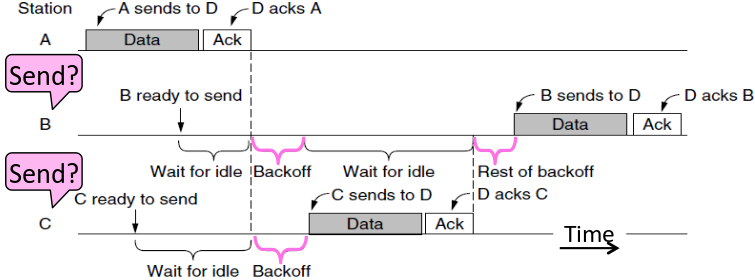

####Contention-Free Multiple Access
CSMA is not good enough under high load

#####Turn-taking Multiple Access Protocols
Define an order in which nodes get a chance to send (or bypass if no traffic)
Can be ordered with a token ring (queue)
* Fixed overhead
* Predictable service
* More complex
* Higher overhead at low load


####LAN Switches
Link <=> Link
To replace Multiple Access
Uses addresses to connect input port to the right output port

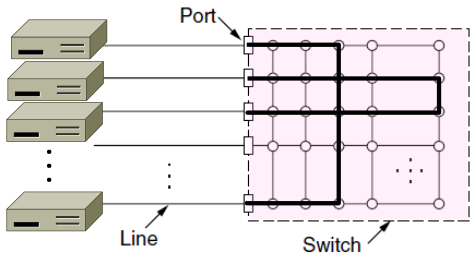

It uses buffers to connect multiple inputs to one outputs (queue)

#####Switch forwarding
To find the right output port, the switch must know the addresses.
It creates a port address table as follows :
1. To fill the table, it looks at the source address of input frames
2. To forward, it sends to the port, or if not known, it broadcasts to all ports

**Forwarding loops :**
Switches collectively find a spanning tree to avoid loops. They then forward as normal but only on the spanning tree.

Rules :
* All switches run the same algorithm
* They start with no information
* Operate in parallel and send messages
* Always search for the best solution

Outline :
1. Elect root node of the tree (switch with lowest address)
2. Grow tree as shortest distance from the root (use lowest address to break distance ties)
3. Turn off ports if they are not on the spanning tree

In practice :
1. Each switch initially believes it is the root
2. Each switch sends periodic updates to neighbours with its address, address of root and distance to root


##Chapter 4 : Network layer

Builds on the link layer.
Routers send packets over multiple networks

Because switches :
* don't scale to large networks
* don't work across more than one link technology (WiFi, Ethernet,...)
* don't give much traffic control (plan routes / bandwidth)

Network layer :
* Scaling (hierarchy in the form of prefixes)
* Heterogeneity (IP for internetworking)
* Bandwidth control (lowest cost routing, Quality of Service QOS)

###Routing and Forwarding
**Routing** is the process of deciding in which direction to send traffic (network wide / global)
**Forwarding** is the process of sending a packet on its way (local)

###Datagram vs Virtual Circuit
####Store and forward
Both models are implemented with store and forward packet switching :
* Router receive a complete packet, stores it temporarily if necessary before forwarding it onwards


####Datagram or connectionless service
* Packets contain a destination address
* Each router uses it to forward each packet, possibly on different paths
* Each router has a forwarding table keyed by address. It gives the next hop for each destination address and may change.


####Virtual Circuit Model

Three phases :
1. Connection establishment (path chosen, circuit info stored in routers)
2. Data transfer (packets are forwarded along the path)
3. Connection teardown (circuit info removed from routers)

* Packets only contain a short label to identify the circuit.
* Labels don't have a global meaning, they are only unique for a link
* Each router has a forwarding table keyed by circuit (gives output line and next label to place on packet)

#####Multi-Protocol Label Switching <a href="#acronym_mpls2" name="acronym_mpls1">MPLS</a>

A virtual-circuit like technology widely used by ISPs
* ISP sets up circuits inside their backbone ahead of time
* ISP adds MPLS label to IP packet at ingress, undoes at egress

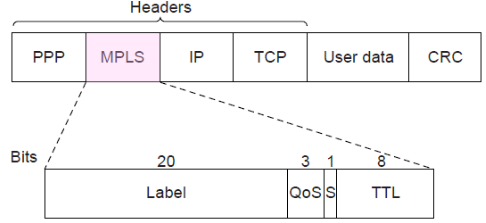

####Advantages / Disadvantages
Issue | Datagrams | Virtual Circuits
:--- | :--- | :---
Setup phase | **Not needed** | Required
Router State | **Per destination** | Per connection
Addresses | Packet carries full address | **Packet carries short label**
Routing | Per packet | **Per circuit**
Failures | **Easier to mask** | Difficult to mask
Quality of Service | Difficult to add | **Easier to add**


###Internetworking

How networks may differ :
* Service model (datagrams, VC)
* Addressing
* QOS (priorities / no priorities)
* Packet sizes
* Security

###IP (Internet Protocol)
Network layer of the Internet

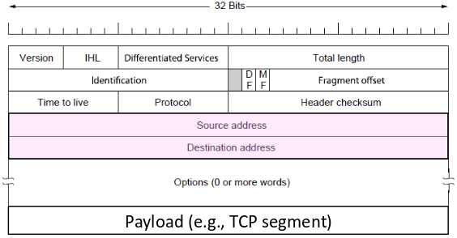

####IP Addresses
IPv4 uses 32-bit addresses written in dotted quad notation

aaaaaaaa . bbbbbbbb . cccccccc . dddddddd

#####IP prefixes
* Address are allocated in blocks called prefixes
* Addresses in an L-bit prefix have the same top L bits
* There are $$$2^{32-L}$$$ addresses with the same L-bit prefix
* Written "IP address/length"
Ex : 128.13.0.0/16 refers to addresses 128.13.0.0 to 128.13.255.255
* A /24 is 256 addresses, a /32 is one address


####IP Forwarding
* IP addresses on one network belong to the same prefix
* Node uses a table that lists the next hop for IP prefixes

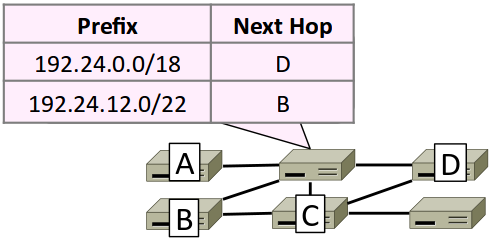

Longest matching prefix forwarding rule :
* Find the longest prefix that contains the destination address (the most specific)
* Forward the packet to the next hop router for that prefix

#####Host/Router distinction
In the internet :
* Router do the routing, know which way to all destination
* Host send remote traffic (out of prefix to nearest router)

Host forwarding table :

prefix | Next Hop
:-- | :--
My network prefix | Send directly to that IP
0.0.0.0/0 | Send to my router

##### Hierarchical routing
* IP prefix (from one host)
* Region (ex: ISP network)
* Route first to the region, then to the IP prefix within the region
* Hide details within a region from outside of the region

####Helping IP with ARP, DHCP
* DHCP : getting an IP address
* ARP Mapping IP to link addresses

#####DHCP
Uses UDP on ports 67 and 68

When a new nodes "wakes up" on a network :
* Node sends broadcast (address all 1s) message that delivered to all nodes on the network.
* DHCP server leases an IP address and sends other infos (network prefix, address of local router, DNS server, time server,...)

To renew an existing lease : REQUEST followed by ACK

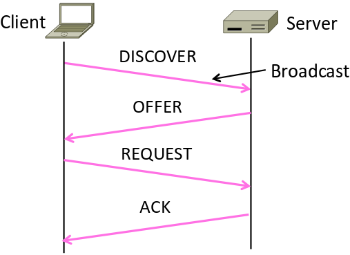

#####ARP protocol

The node needs the link layer addresse to send a frame over the local link (it only has its IP address)

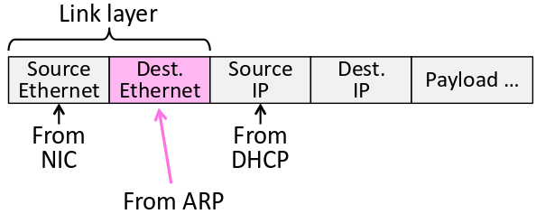

To do this, it just asks (broadcast) the node with target IP to identify itself


####Packet size problem
* Different networks have different maximum packet sizes or <a name="acronym_mtu1" href="#acronym_mtu2">MTU</a>
* Prefer large packets for efficiency

#####IPv4 Fragmentation
Routers fragment packets that are too large to forward
Receiving host reassembles to reduce load on routers


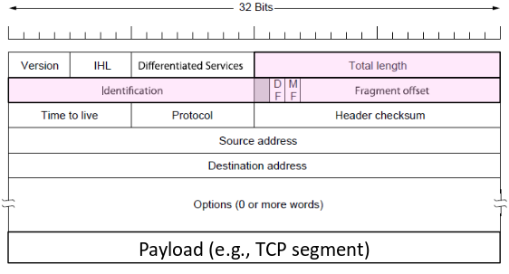

* Gives more work for routers / hosts
* Magnifies packet loss
* Security vulnerabilities

#####Path MTU Discovery
Discover the max MTU that will fit :
Host test with large packet. If too large, routers tell host what size would have fit

Set DF (Don't Fragment) bit in IP header to get feedback messages from router


####Internet Control Message Protocol <a name="acronym_icmp1" href="#acronym_icmp2">ICMP</a>

* To find the problem when something goes wrong during forwarding.
* Sits on top of IP
* Provides error report and testing (function that hosts can use)

When router encounters an error while forwarding :
* It sends an ICMP error report to IP source address
* It discards the problematic packet

#####ICMP message format
Contains a Type, Code and Checksum
Carried in an IP packet

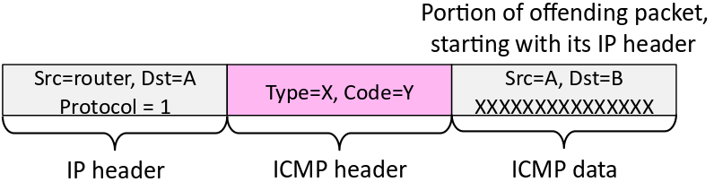


#####Traceroute
IP header contains TTL (Time To Live) field
It Decrements every router hop with ICMP error when it hits zero (protects against forwarding loops)


####IPv6

* Large addresses (128 bits)
* New notation : 8 groups of 4 hex digits (16 bits)
ex : 2001:0db8:0000:0000:0000:ff00:0042:8329 

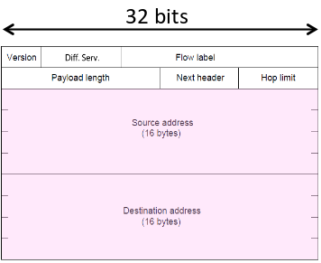

Approaches proposed for transition to IPv6 :
* Dual stack (speak IPv4 and IPv6)
* Translators
* **Tunnels** (carry IPv6 over IPv4)


####Network Address Translation <a name="acronym_nat1" href="#acronym_nat2">NAT</a>

Connects an internal network to an external network
Middlebox that translates addresses (public/private)

* It keeps an internal / external table (IP address + TCP port)
* Needs ports to make mapping (there are fewer external IPs)
* For new translations : it creates an external name when host makes a TCP connection
* Look up and rewrite IP/port

###Routing

* Routing has a better method than the spanning tree. It uses all links to find the "best" path
* It allocates network bandwidth adapting to failures

Properties we want :

Property | Meaning
:-- | :--
Correctness | Find paths that work
Efficient paths | Uses network bandwidth well
Fair paths | Doesn't starve any node
Fast convergence | Recovers quickly after changes
Scalability | Works well as network grows large


Rules of algorithms :
* All nodes are alike (no controller)
* Nodes only know what they learn by exchanging messages with neighbours
* Nodes operate concurrently
* May be node/link/message failures

####Shortest path routing

"Best" path :
* Latency (avoid circuitous paths)
* Bandwidth (avoid small pipes)
* Money (avoid expensive links)
* Hops (reduce switching)

**Optimality property** : Subpaths of shortest paths are also shortest paths
**Sink trees** : The sink tree for are destination is the union of all shortest paths towards the destination (similarly source tree)

Forwarding table at a node : Lists next hop for each destination

#####Dijkstra's algorithm

Set distance from source to 0 for source and $$$\infty$$$ for all other nodes
While tentative node remain :
1. Extract N, a node with lowest distance
2. Add link to N to the shortest path tree
3. Relax the distances of neighbours of N by lowering any better distance estimate


#####Distance vector routing
* To compute shortest paths in a distributed network
* Used in ARPANET and RIP (Routing Information Protocol)
* Two main approaches :
    - Distributed version of Bellman-Ford (very slow convergence after failures)
    - Link-state algorithms (used in practice)

Settings :
* Nodes know only the cost to their neighbours, not the topology
* Nodes can talk only to their neighbours using messages
* All nodes run the same algorithm concurrently
* Nodes and links may fail, messages may be lost

Algorithm :
Each node maintains a vector of distances (and next hops) to all destinations
1. Initialize vector with 0 cost to self, $$$\infty$$$ to other destinations
2. Periodically send vector to neighbours
3. Update vector for each destination by selecting the shortest distance heard, after adding cost of neighbour link

Use the best neighbour for forwarding

**Dynamics :**
Adding route : News travels one hop per exchange
Removing routes : When a node fails, no more exchanges, other nodes forget
Partitions (unreachable nodes in divided network) : Problem -> count to infinity scenario (The node don't tell neighbours how near it is and other nodes just tell each other a length which increases every time.)


#####Flooding
Broadcast a message to all nodes in the network

1. Send an incoming message on to all other neighbours
2. Remember the message so that it is only sent once over each link (duplicate suppression)

Use ARQ to make flooding reliable


#####RIP (Routing Information Protocol)
* DV protocol with hop count as metric (limits network size with $$$\infty$$$ at 16 hops)
* Includes split horizon, poison reverse (Don't send route back to where you learned it from)
* Runs on top of UDP
* Send vectors every 30 secs (180 sec timeout to detect failures)


#####Link-State Routing
* Trades more computation than distance vector for better dynamics
* Widely used in practice (Internet, ARPANET)


Settings (same as DV) :
* Nodes know only the cost to their neighbours, not the topology
* Nodes can talk only to their neighbours using messages
* All nodes run the same algorithm concurrently
* Nodes and links may fail, messages may be lost

Algorithm :
1. Each node flood topology in the form of link state packets (LSP) -> Each node learns full topology
2. Each node computes its own forwarding table by running Dijkstra

Complications :
* Seq number reaches max, or is corrupted
* Node crashes and loses seq. number
* Network partitions then heals

Solution : Include age on LSPs and forget old information that is not refreshed

#####DL vs LS
Goal | Distance Vector | Link State
:-- | :-- | :--
Correctness| Distributed Bellman-Ford | Replicated Dijkstra
Efficient paths| Approx with shortest paths | Approx. with shortest paths
Fair paths| Approx. with shortest paths | Approx. with shortest paths
Fast convergence| Slow - Many exchanges | **Fast - flood and compute**
Stability| **Excellent - storage/compute** | Moderate - storage/compute

#####IS-IS and OSPF protocols
Widely used in large enterprises and ISP networks
* IS-IS : Intermediate System to Intermediate System
* OSPF : Open Shortest Path First

Link state protocols with many features added


#####Equal Cost Multi-Path (ECMP) routing
* For paths with equal costs
* Topology has them for redundancy
* Extend shortest path model by keeping set if there are ties


####Routing with multiple parties
Structure of the internet :
* Networks (ISP, CDNs, ...) group hosts as IP prefixes
* Networks are richly interconnected (often using IXPs)

Two problems :
1. Scaling to very large networks (IP prefixes, hierarchy, prefix aggregation)
2. Incorporating policy decision (Parties choose their routes to suit their own needs) => (Hot potato) routing

#####Routing policies
Transit :
* One party (customer) gets transit service from another party (ISP)

Peer :
* Both parties (for example ISP) get peer service from each other
* They accept traffic from the other ISP only for their customers but do not carry traffic to the rest of the internet for each other

#####Border Gateway Protocol (BGP)
BGP is the protocol that computes interdomain routes in the Internet
Border routers announce BGP routes to each other

Policy :
1. Border routers of ISP announce paths only to other parties who may use those paths
2. Border routers of ISP select the best path of the ones they hear in any, non-shortest way

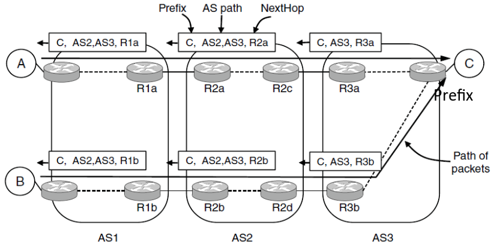


##Chapter 5 : Transport Layer


Builds on the network layer to deliver data across networks for applications with the desired reliability or quality.

Services :

 | Unreliable | Reliable
:-- |:--|:--
**Message**| Datagrams (UDP)|
**Bytestream**| | Streams (TCP)
TCP is full-featured, UDP is a glorified packet

TCP (streams)|UDP (Datagrams)
:--|:--
Connections | Datagrams
Bytes are delivered once, reliably, and in order | Messages may be lost, reordered and duplicated
Arbitrary length content | Limited message size
Flow control matches sender to receiver | Can send regardless of receiver state
Congestion control matches sender to network | Can send regardless of network state

###Socket API
* Abstraction to use the network
* Part of all major OSes and languages
* Supports both Internet transport services (streams and datagrams)
* Sockets let apps attach to the local network at different ports

API :

Primitive | Meaning
:-- | :--
SOCKET | Create a new communication endpoint
BIND | Associate a local address (port) with a socket
LISTEN | Announce willingness to accept connections
ACCEPT | Passively establish an incoming connection
CONNECT | Actively attempt to establish a connection
SEND(TO) | Send some data over the socket
RECEIVE(FROM) | Receive some data over the socket
CLOSE | Release the socket

####Ports
* Application identified by tuple : IP address, Protocol, Port
* Ports are 16-bit integers
* <1024 requires administrative privileges
* Servers often bind to well-known ports, clients often assigned ephemeral ports chosen by OS

Some well-known ports :

Port | Protocol
:-- | :--
20,21 | FTP
22 | SSH
25 | SMTP
80 | HTTP
110 | POP-3
143 | IMAP
443 | HTTPS
543 | RTSP
631 | IPP


###User Datagram Protocol (UDP)

Used by apps that don't want reliability or bytestreams (es : VOIP, DNS, RPC, DHCP)


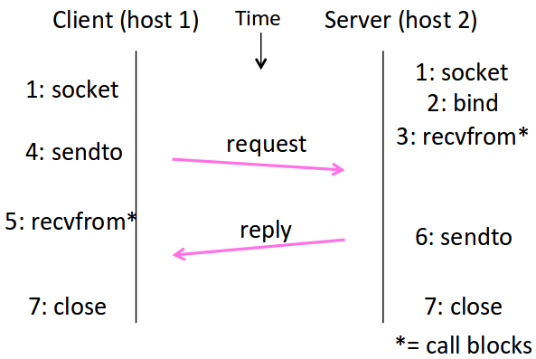

#####UDP Header
* Uses ports to identify application processes
* Datagram length up to 64K
* Checksum (16 bits for reliability)

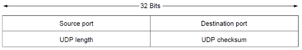

###Transmission Control Protocol (TCP)

####Connection establishment

Both sender and receiver must be ready before we start the transfer of data. Need to agree on a set of parameters

#####Three-Way Handshake

Each side probes the other with a fresh Initial Sequence Number (ISN)

Three steps to establish a connection :
1. Client sends SYN(x) (SYNchronize)
2. Server replies with SYN(y)ACK(x+1)
3. Client replies with ACK(y+1)
4. SYNs are retransmitted if lost


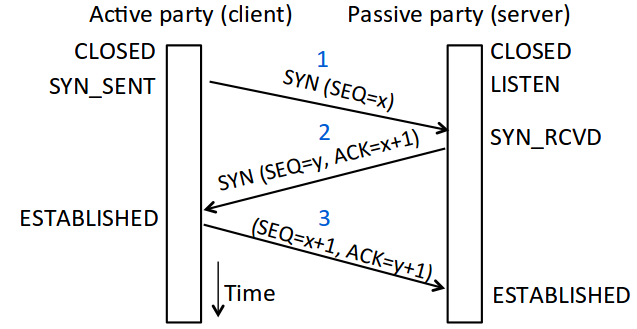

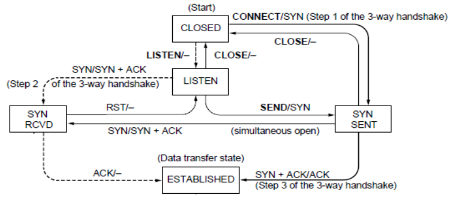


Two steps to close a connection :
1. Active sends FIN(x), passive ACKs
2. Passive sends FIN(y), active ACKs
3. FINs are retransmitted if lost

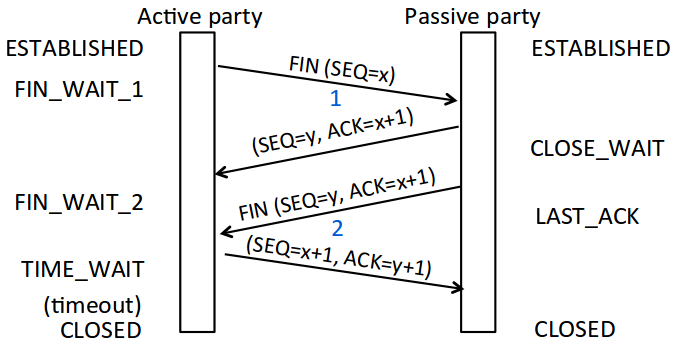

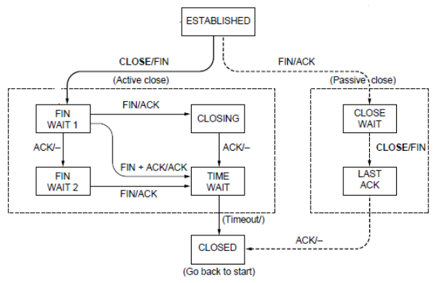


####Sliding Windows

* Better than Stop-and-Wait (one message + ARQ)
* Allows W packets to be outstanding
* Needs W=2<a href="#bd" name="bd2">BD</a> to fill network path

#####Sender
Sender buffers up to W segments until they are acknowledged
Sends while LFS (Last Frame Sent) - LAR (Last ACK Rec'd) <= W


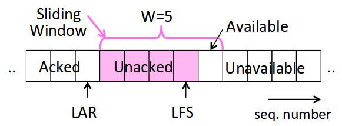

#####Receiver

**Go-Back-N**
* Receiver keeps only a single packet buffer for the next segment (state variable LAS = Last Ack Sent)
* Discard if seq. number != LAS+1

**Selective Repeat**
* Receiver buffers W segments, keeps state variable LAS (Last Ack Sent)
* On receive :
    1. Buffer segments [LAS+1, LAS+W]
    2. Pass up to app in-order segments from LAS+1 and update LAS
    3. Send ACK for LAS

#####Sequence numbers
Needs 2W seq. numbers for Selective Repeat and W+1 for Go-Back-N

#####Flow Control
* Receiver tells the sender the available buffer space WIN (Flow Control Window)
* Sender uses the lower of the sliding window and flow control window (WIN) as the effective window size

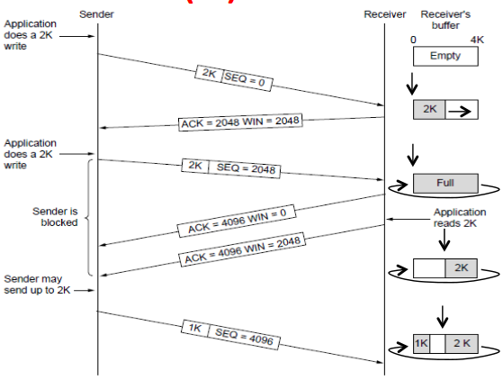

####Timeout problem
* Timeout must be variable on the Internet because RTT (Round Trip Time) varies.
* Adaptive timeout keeps a smoothed estimate of the RTT and its variance :
$$$SRTT_{N+1} = 0.9\cdot SRTT_N + 0.1\cdot RTT_{N+1}$$$
$$$Svar_{N+1} = 0.9\cdot Svar_N + 0.1\cdot \left|RTT_{N+1} - SRTT_{N+1}\right|$$$
* Set timeout to an multiple of estimates :
TCP Timeout = $$$SRTT_N + 4\cdot SVAR_N$$$

####Reliable Bytestream
* Messages boundaries are not preserved from send() to recv() but are reliable and ordered.

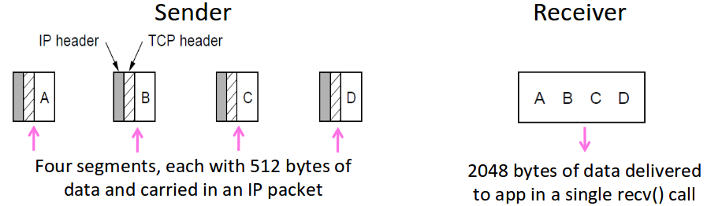

* Bidirectional data transfer

####TCP Header

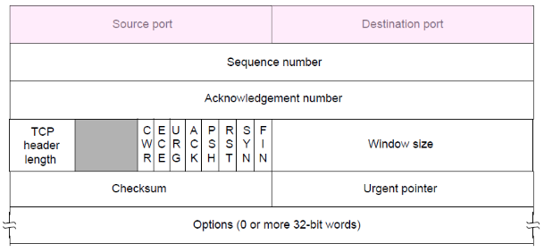


##Chapter 6 : Congestion Control


##Acronyms
Acronym | Meaning | Description
:------ | :------ | :----------
AP | Access Point | See 802.11
ARP | Address Resolution Protocol |
<a name="acronym_arq2" href="#acronym_arq1">ARQ</a> | Automatic Repeat reQuest |
<a name="acronym_beb2" href="#acronym_beb1">BEB</a> | Binary Exponential Backoff |
BGP | Border Gateway Protocol | Protocol to compute interdomain routes in the Internet
<a name="acronym_crc2" href="#acronym_crc1">CRC</a> | Cyclic redundancy check |
<a name="acronym_csma2" href="#acronym_csma1">CSMA</a> | Carrier Sense Multiple Access |
<a name="acronym_csmacd2" href="#acronym_csmacd1">CSMA/CD</a> | Carrier Sense Multiple Access with Collision Detection |
<a name="acronym_cts2" href="#acronym_cts1">CTS</a> | Clear To Send |
DHCP | Dynamic Host Configuration Protocol |
DV | Distance Vector (protocol) |
ECMP | Equal-Cost Multi-Path routing | Shortest paths with more than one path
<a name="acronym_fdm2" href="#acronym_fdm1">FDM</a> | Frequency Division Multiplexing |
IANA | Internet Assigned Numbers Authority | Allocates public IP addresses (delegates to regional RIRs)
<a name="acronym_icmp2" href="#acronym_icmp1">ICMP</a> | Internet Control Message Protocol |
ISN | Initial Sequence Number |
ISP | Internet Service Provider
IS-IS | Intermediate System to Intermediate System |
IXP | Internet Exchange Point | Permet aux différents ISP d'échanger du trafic Internet entre leurs réseaux
Lan | Local Area Network | ex : WiFi, Ethernet
<a name="acronym_ldpc2" href="#acronym_ldpc1">LDPC</a> | Low Density Parity Check | State of the art today to correct errors in messages
LSP | Link State Packet |
<a name="acronym_mac2" href="#acronym_mac1">MAC</a> | Multiple Access Control or Medium Access Control | 
<a name="acronym_maca2" href="#acronym_maca1">MACA</a> | Multiple Access with Collision Avoidance |
Man | Metropolitan Area Network | ex : Cable, DSL
MF | More Fragments | Bit in IP header, 1 if more fragments are following
<a href="#acronym_mpls1" name="acronym_mpls2">MPLS</a> | Multi-Protocol Label Switching |
<a name="acronym_mtu2" href="#acronym_mtu1">MTU</a> | Maximum Transmission Unit |
<a name="acronym_nat2" href="#acronym_nat1">NAT</a> | Network Address Translation |
<a name="nrz_acronym1" href="#nrz_acronym2">NRZ</a> | Non Return to Zero |
OSPF | Open Shortest Path First |
Pan | Personal Area Network | ex : Bluetooth
QOS | Quality Of Service |
RIP | Routing Information Protocol |
<a name="acronym_rts2" href="#acronym_rts1">RTS</a> | Request To Send |
RTT | Round Trip TIme |
<a name="snr_acronym2" href="#snr_acronym1">SNR</a> | Signal to Noise Ratio | S/N
TCP | Transmission Control Protocol |
<a name="acronym_tdm2" href="#acronym_tdm1">TDM</a> | Time Division Multiplexing |
TTL | Time To Live |
UDP | User Datagram Protocol |
VC | Virtual Circuit |
Wan | Wide Area Network | Large ISP
