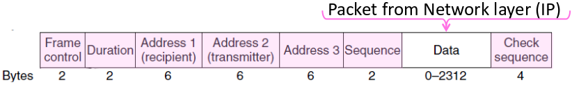

#OS & Network Summary
##Table of Content
[TOC]

##Chapter 1

###Parts of a Network
Component | Function | Example
:-------- | :------- | :------
**Application**, or app, user  | Uses the network | Skype, iTunes, Amazon
**Host** , or end-system, edge device, node, source, sink | Supports apps | Laptop, mobile, desktop
**Router**, or switch, node, hub, intermediate system | Relays messages between links | Access point, cable / DSL moden
**Link**, or channel | Connects nodes | Wires, wireless


###Key interfaces

* Network-application interfaces define how apps use the network (Sockets widely used)
* Network-network interfaces define how nodes work together (ex : Traceroute)

Network service API hides details (Apps don't know what is inside the network)


###Protocols and layers
To divide up network functionality

* Each instance of a protocol talks virtually to its peer using the protocol
* Each instance of a protocol uses only the services of the lower layer

Protocol stack example :


**Encapsulation : ** Lower layer wraps higher layer content and add its own information

**Advantage of layering : ** Information hiding and reusability
**Disadvantages of layering : ** Overhead and hides information


#####OSI "7 layer" Reference Model

| | Layer | Description |
| - | :-- | :---------- |
|7 | Application | Provides functions needed by users|
|6 | Presentation | Converts different data representations|
|5| Session | Manages task dialogs
|4| Transport | Provides end-to-end delivery
|3| Network | Sends packets over multiple links
|2| Data link | Sends frames of information
|1| Physical | Sends bits as signals

#####Four layer model

Based on experience

 | Layer | Description |
- |:-- | :---------- |
7 |Application | Programs that use network service
4 |Transport | Provides end-to-end data delivery
3 |Internet | Send packets over multiple networks
2 (/1) |Link (/Physical) | Send frames over a link (/Sends bits using signals)

#####Internet Reference Model


#####Layer-based names

Layer | Unit of Data
:-|:-
Application | Message
Transport | Segment
Network | Packet
Link | Frame
physical | Bit

Devices in the network :
* Repeater (Hub) : Physical/Physical
* Switch (bridge) : Link/Link
* Router : Network+Link / Network+Link
* Proxy (middlebox, gateway) : App+Transport+Network+Link


##Chapter 2 : Physical Layer

###Socket API

Primitive | Meaning
:-|:-
SOCKET | Create a new communication endpoint
BIND | Associate a local address with a socket
LISTEN | Announce willingness to accept connections; give queue size
ACCEPT | Passively wait for an incoming connection
CONNECT | Actively attempt to establish a connection
SEND | Send some data over the connection
RECEIVE | Receive some data from the connection
CLOSE | Release the connection

###Simple link model
Properties : Rate, Delay/Latency, wether the channel is broadcast, its error rate

##### Rate
Or bandwith, capacity, speed
in bits/second

#####Delay / latency

* Transmission delay $$$T$$$: Time to put M-bit message on the wire
$$
T = \frac{M [bits]}{Rate\left[\frac{bits}{s}\right]} = \frac{M}{R} [s]
$$

* Propagation delay $$$D$$$ : time for bits to propagate across the wire
$$
D = \frac{Length}{Speed of signals} = \frac{L}{\frac{2}{3}C}
$$

* Latency $$$L$$$ : delay to send a message over a link
$$
L = T + D = \frac{M}{R} + \frac{L}{\frac{2}{3}C}
$$

#####Bandwidth-delay product

The amount of data "in flight"
$$BD = R\cdot D$$

###Types of Media
**Media** propagate signals that carry bits information.
Common types :
* Wires
* Fiber
* Wireless

#####Wireless
* Travel at speed of light
* Spread out and attenuate faster than $$$\frac{1}{d^2}$$$
* Interference between signals on the same frequency (=> spatial reuse of same freq)
* Multipath : signal interferes with itself after reflexion

### Modulation
How the signals represent bits


* <a name="nrz_acronym2" href="#nrz_acronym1">NRZ</a> : A high voltage +V represents a 1 and a low voltage -V represents a 0

#####Clock recovery
Receiver needs frequent signal transitions to decode bits (synchronisation)
######4b/5b
* Map every data bits into 5 code bits without long runs of zeros

4b | 5b
- | -
0000|11110
0001|01001
1110|11100
...|...
1111|11101

* Invert signal level on every 1 (NRZI)

**Example :**
message : 1111 0000 0001


#####Baseband vs Passband modulation
**Baseband** : Signal is sent directly on a wire (wires)
**Passband** : Modulation carries a signal by modulating a carrier (fiber / wireless)
######Passband
Carrier is a signal oscillating at desired frequency. We modulate it by changing amplitude, frequency or phase


####Fundamental limits
#####Key channel properties
* Bandwidth B
* Signal strength S
* Noise strength N

#####Nyquist limit/frequency
If we have a channel with a bandwidth $$$B$$$, the maximum symbol rate is $$$2B$$$.
If we have V signal levels ($$$log_2V$$$ different bits), the maximum bit rate is
$$R=2B\cdot log_2V \left[\frac{bits}{s}\right]$$

#####Shannon capacity
The number of levels we can distinguish on a channel depends on the <a name="snr_acronym1" href="snr_acronym2">SNR</a> (~ S/N)

The Shannon capacity C is the maximum information carrying rate of the channel
$$C = B\cdot log_2\left(1+\frac{S}{N}\right) \left[\frac{bits}{s}\right]$$

**Wires / Fiber :**
Engineer SNR for data rate

**Wireless :**
Adapt data rate to SNR (can't design for worst case)


##Chapter 3 : Link Layer
Concerns how to transfer messages (frames, of limited size) over one or more connected links

###Framing
Transform stream of bits from physical layer to sequence of frames
#####Byte count
* Start each frame with a length field
* Difficult tu resynchronize after framing error

#####Byte stuffing
* Use a flag byte value for start/end of frame
* Escape the flag (and the escape code) inside the message replacing (stuffing) it with an escape code

#####Bit stuffing
* Flag with six consecutive 1
* In the message, insert a 0 after five 1 when sending and remove every 0 after five 1 when receiving
* Slightly less overhead than byte stuffing but more complicated -> byte stuffing used in practice

###Error coding

####Using error codes
Codeword consists of data bits D plus check bits R


#####Hamming distance
* The distance is the number of bit flips needed to change $$$D+R_1$$$ to $$$D+R_2$$$
* The Hamming distance of a code is the minimum distance between a pair of codewords
* For a code of Hamming distance d+1, up to d errors will always be detected
* For a code of Hamming distance 2d + 1, up to d errors can always be corrected by mapping to the closest codeword

####Error Detection
* Parity bit : The parity bit is the sum of the bits of D (distance : 2 -> detect 1 error); Little used
* Checksum : Sum up data in N-bit word (Stronger than parity)
* Internet Checksum
* <a href="#acronym_crc1">CRC</a>

**In practice :**
* CRCs used on links (Ethernet, 802.11, ADSL, Cable)
* Checksum used in Internet (IP, TCP, UDP)

#####Internet Checksum
Sending :
1. Arrange data in 16-bit words
2. Add
3. Add any carryover back to get 16 bits
4. Negate (complement) to get the checksum

Receiving :
1. Arrange data in 16-bit words (including checksum)
2. Add
3. Add any carryover back to get 16 bits
4. Negate the result and check if 0

Example :
```
1.	  0001
   	 f203
   	 f4f5
2.	+ f6f7
	  ------
	   2ddf0
```
```
  	  ddf0
3.	+    2
	  ------
        ddf2

4. -> 220d
```
Transmit to physical layer : 0001 f203 f4f5 f6f7 220d


```
1.	  0001
   	 f203
   	 f4f5
	    f6f7
2.	+ 220d
	  ------
	   2rffd
```
```
  	  fff0
3.	+    2
	  ------
        ffff

4. -> 0000
```

* Distance of the code : 2
* Will always detect up to 1 error
* Will detect all burst errors up to 16
* For random errors, probability of miss is $$$\frac{1}{2^{16}}$$$ ($$$2^{16}$$$ different checksums)

#####<a name="acronym_crc1" href="#acronym_crc2">Cyclic redundancy check</a>

For data D of length n, generate check bits R of length k such that the n+k bits are evenly divisible by a generator C.

* Protection depend on generator (standard has 32bits C)
* Humming distance of 4
* Detects odd numbers of errors
* Detects bursts of up to k bits in error
* Not vulnerable to systematic errors

**Example :**
D = 302, C = 3, k (length of R) = 1
=> R = 1 because $$$\frac{3021}{3} = 0$$$

**Send procedure :**
1. Extend D with k zeros
2. Divide by the generator C
3. Ignore quotient
4. Set check bits R as the remainder

**Receive procedure :**
1. Divide by C and check for zero remainder

**Example :**
D = 10111
C = 100
k = length(C) - 1 = 2

```
101 | 1011100
      101
      ---
       001
       000
       ---
        011
        000
        ---
         110
         101
         ---
           10 = R
```
Transmitted frame : 1011110

####Error correction
It is difficult because errors can be in the check bits

#####Hamming code
Gives a method for constructing a code with a distance of 3.

**To encode :**
* With k check bits, we can check data of length $$$n = 2^k - k - 1$$$; ex: $$$k=3$$$, $$$n=4$$$
* The check bits are in positions $$$p_i$$$ that are powers of 2, starting with position 1 (1, 2, 4, 8...)
* Fill the free positions with the data bits (positions 3, 5, 6, 7...)
* Check bit in position $$$p_i$$$ is the parity of the bits at positions $$$p_j$$$ for which the $$$i^{th}$$$ bit in $$$j$$$ is 1 (ex: $$$p_2$$$ is the sum of all the bits at positions $$$p_j$$$ where the second bit in $$$j$$$ is 1 => 10 (2), 11 (3), 110 (6), 111 (7), 1010 (10), ...)

**To decode :**
* Recompute check bits $$$p_i$$$ (with parity sum including the check bit)
* Arrange as a binary number ($$$\dots p_8p_4p_2p_1$$$)
* If the value (syndrome) is zero, it means there is no error
* Otherwise the syndrome is the position of the error, flip the bit at this position

#####Detection vs Correction
**Correction**
* When error are expected and in small number
* When no time for retransmission
* Used in physical layer (<a name="acronym_ldpc1" href="#acronym_ldpc2">LDPC</a>)
* Sometimes used in the application layer

**Detection**
* When errors are not expected
* When errors are generally large
* Used in the link layer and above

###Retransmissions (<a name="acronym_arq1" href="#acronym_arq2">ARQ</a>)
* Receiver automatically acknowledges correct frames with an ACK
* Sender automatically resends after a timeout if no ACK is received
* Frames and ACKs must carry sequence numbers to avoid duplicates

#####Stop and wait
Use one bit to distinguish the current frame from the next one. Send one frame at a time

#####Sliding Window
Generalization of stop-and-wait
Allows W frames to be outstanding

###Multiplexing
Network word for the sharing of a resource
* <a name="acronym_tdm1" href="#acronym_tdm2">Time Division Multiplexing</a> : Users take turns on a fixed schedule (ex : Round-Robin)
* <a name="acronym_fdm1" href="#acronym_fdm2">Frequency Division Multiplexing</a> : Put different users on different frequency bands


####Multiple Access Control or Medium Access Control (<a name="acronym_mac1" href="#acronym_mac2">MAC</a>)

####Random Multiple Access
Basis for classic Ethernet

#####ALOHA protocol
* Node sends when it has traffic
* If there was a collision (no ACK received), wait a random amount of time and resend
* Works well only under low load

#####Carrier Sense Multiple Access(<a name="acronym_csma1" href="#acronym_csma2">CSMA</a>)
* Improve ALOHA by listening for activity before sending
* Collision can still occur because of delays

#####Carrier Sense Multiple Access with Collision Detection(<a name="acronym_csmacd1" href="#acronym_csmacd2">CSMA/CD</a>)
* Reduce the cost of collision by detecting them and aborting (jam) the rest of the frame

For a wire of max length (time) D, we impose a minimum frame size that lasts for 2D seconds. This way everyone who collides knows that it happened. A node can't finish before a collision

#####CSMA persistence
To avoid collision between nodes who queued up waiting for the current sender to finish
For N queued senders, each one sends with next with probability $$$\frac{1}{N}$$$

#####Binary Exponential Backoff (<a name="acronym_beb1" href="#acronym_beb1">BEB</a>)
Estimates the probability for CSMA persistence

* Double interval for each successive collision
* Quickly gets large enough to work and very efficient in practice

1st collision : wait 0-1 time frames
2nd collision : wait 0-3 time frames
3rd collision : wait 0-7 time frames
...

#####Ethernet
* Multiple access with 1-persistent CSMA/CD with BEB (Modern ethernet based on switches)
* Has two addresses for destination and source, CRC-32 for error detection (no ARQ)
* Physical layer preamble to identify start of frame


####WIreless Multiple Access
* Nodes share a single link
* Nodes can't carrier sense (different areas of coverage)
* Nodes can't hear while sending (can't collision detect)

=> WiFi can't use CSMA/CD

**Different Coverage Areas**
Signal is bradcast and received nearby where SNR is sufficient


**Hidden terminals**
A and C are hidden terminals : Can't hear each other but can collide at B


**Exposed terminals**
B and C can hear each other but don't collide at A and D


#####Multiple Access with Collision Avoidance (<a name="acronym_maca1" href="#acronym_maca2">MACA</a>)

Use short handshake instead of CSMA :
1. Senter node transmits a <a name="acronym_rts1" href="#acronym_rts2">RTS</a> with frame length
2. Receiver node replies with a <a name="acronym_cts1" href="#acronym_cts2">CTS</a> with frame length
3. Sender transmits the frame while other nodes hearing the CTS remain silent

Collision are possible but less likely

#####802.11
* Clients get connectivity from an Access Point (AP)
* O<a href="#acronym_fdm2">FDM</a> modulation
* Different amplitudes/phases for varying SNRs
* Multiple access uses CSMA/CA; RTS/CTS optional
* ARQ
* Three addresses (due to AP)
* Errors detected with a CRC-32
* Many other features (encryption, power save)



**802.11 CSMA/CA :**
Sender avoids collision by inserting a small random gap (backoff) before sending


####Contention-Free Multiple Access
CSMA is not good enough under high load

#####Turn-taking Multiple Access Protocols
Define an order in which nodes get a chance to send (or bypass if no traffic)
Can be ordered with a token ring (queue)
* Fixed overhead
* Predictable service
* More complex
* Higher overhead at low load


####LAN Switches
Link <=> Link
To replace Multiple Access
Uses addresses to connect input port to the right output port


It uses buffers to connect multiple inputs to one outputs (queue)

#####Switch forwarding
To find the right output port, the switch must know the addresses.
It creates a port address table as follows :
1. To fill the table, it looks at the source address of input frames
2. To forward, it sends to the port, or if not known, it broadcasts to all ports

**Forwarding loops :**
Switches collectively find a spanning tree to avoid loops. They then forward as normal but only on the spanning tree.

Rules :
* All switches run the same algorithm
* They start with no information
* Operate in parallel and send messages
* Always search for the best solution

Outline :
1. Elect root node of the tree (switch with lowest address)
2. Grow tree as shortest distance from the root (use lowest address to break distance ties)
3. Turn off ports if they are not on the spanning tree

In practice :
1. Each switch initially believes it is the root
2. Each switch sends periodic updates to neighbours with its address, address of root and distance to root


##Chapter 4 : Network layer


##Acronyms
Acronym | Meaning | Description
:------ | :------ | :----------
Pan | Personal Area Network | ex : Bluetooth
Lan | Local Area Network | ex : WiFi, Ethernet
Man | Metropolitan Area Network | ex : Cable, DSL
Wan | Wide Area Network | Large ISP
<a name="nrz_acronym1" href="#nrz_acronym2">NRZ</a> | Non Return to Zero |
<a name="snr_acronym2" href="snr_acronym1">SNR</a> | Signal to Noise Ratio | S/N
<a name="acronym_crc2" href="#acronym_crc1">CRC</a> | Cyclic redundancy check |
<a name="acronym_ldpc2" href="#acronym_ldpc1">LDPC</a> | Low Density Parity Check | State of the art today to correct errors in messages
<a name="acronym_arq2" href="#acronym_arq1">ARQ</a> | Automatic Repeat reQuest |
<a name="acronym_tdm2" href="#acronym_tdm1">TDM</a> | Time Division Multiplexing |
<a name="acronym_fdm2" href="#acronym_fdm1">FDM</a> | Frequency Division Multiplexing |
<a name="acronym_mac2" href="#acronym_mac1">MAC</a> | Multiple Access Control or Medium Access Control | 
<a name="acronym_csma2" href="#acronym_csma1">CSMA</a> | Carrier Sense Multiple Access |
<a name="acronym_csmacd2" href="#acronym_csmacd1">CSMA/CD</a> | Carrier Sense Multiple Access with Collision Detection |
<a name="acronym_beb2" href="#acronym_beb1">BEB</a> | Binary Exponential Backoff |
<a name="acronym_maca2" href="#acronym_maca1">MACA</a> | Multiple Access with Collision Avoidance |
<a name="acronym_rts2" href="#acronym_rts1">RTS</a> | Request To Send |
<a name="acronym_cts2" href="#acronym_cts1">CTS</a> | Clear To Send |
AP | Access Point | See 802.11